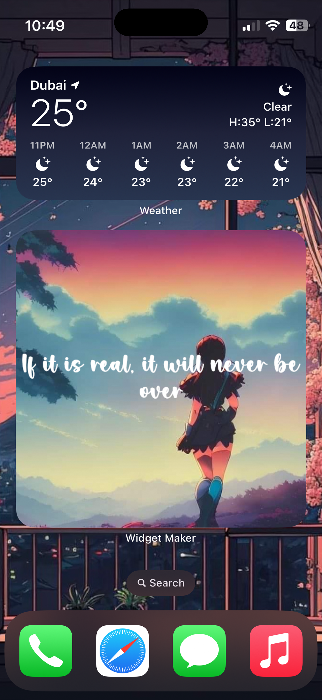
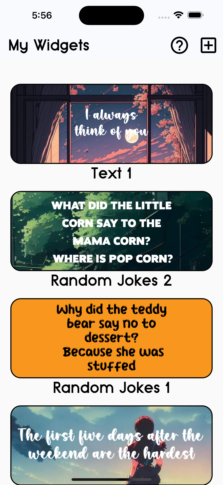
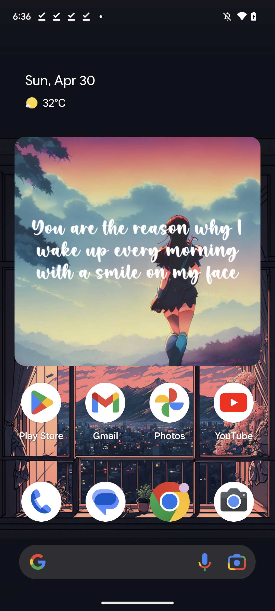
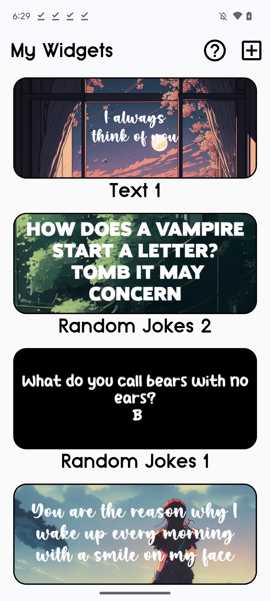

[](https://pub.dartlang.org/packages/native_widget)
<a href="https://www.buymeacoffee.com/akdebuging" target="_blank"> </a>
[](https://t.me/+NvUXzshmIg44N2M0)
[](https://www.youtube.com/@AkDebuging)
[](https://twitter.com/akdebuging) [](https://apps.apple.com/us/developer/abedalkareem-omreyh/id928910207) [](https://play.google.com/store/apps/dev?id=7470619810055517011)

<center></center>

Create a native timelined home widget with flutter widgets!

## Screenshots  
### iOS  

<center> </center>

### Android  

<center> </center>

## Apps used this plugin
You can check these apps to have an idea about how this plugin can be used:
- Widget Maker [iOS](https://apps.apple.com/sa/app/widget-maker-create-widgets/id6448733153) [Android](https://play.google.com/store/apps/details?id=com.jordanstudio.widget_maker)

## Getting Started

Please check the docs folder.

## How does it work?

This plugin is for you if you want to create a timelined widgets, timelined widgets are calucated and provided to the system ahead of time. And you will be feeding the plugin with base64 images created from your Flutter widgets.

## Installing  
Simply add the following line to your pubspec.yaml file:  
``` yaml
dependencies:
  native_widget: any       # <-- Add this line
```

## Support me 🚀  

You can support this project by:  

1- Checking my [apps](https://apps.apple.com/us/developer/id928910207).  
2- Star the repo.  
3- Share the repo with your friends.  
4- [Buy Me A Coffee](https://www.buymeacoffee.com/akdebuging).  

## Follow me ❤️  

[Facebook](https://www.facebook.com/akdebuging/) | [Twitter](https://twitter.com/akdebuging) | [Instagram](https://instagram.com/abedalkareemomreyh/) | [Youtube](https://www.youtube.com/@akdebuging)